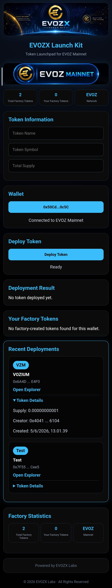

EVOZX Launch Kit

Token Launchpad for EVOZ Mainnet

 Deploy ERC20 Burnable Tokens directly on EVOZ Mainnet.

No coding required.

Wallet → Create → Deploy

---

Launch Kit Preview

---

Overview

EVOZX Launch Kit is a lightweight ERC20 token launchpad built for the EVOZ ecosystem.

Users can create their own ERC20 Burnable tokens directly from a mobile or desktop wallet without writing Solidity code.

Supported wallets:

- TokenPocket
- MetaMask
- OKX Wallet
- Bitget Wallet
- Rabby Wallet

---

Features

Token Creation

- ERC20 Standard
- ERC20 Burnable
- Instant Deployment
- Creator Receives Full Supply

Wallet Integration

- Connect Wallet
- Auto Network Switch
- EVOZ Mainnet Support

Explorer Integration

- Token Contract Links
- Transaction Links
- Explorer Navigation

Statistics

- Total Factory Tokens
- Your Factory Tokens
- Recent Deployments

Mobile Friendly

- Android Support
- iOS Support
- Responsive UI

---

Network Information

EVOZ Mainnet

Factory Address

0x3F810a44D29a4f0fF7880641E69EBCBc076dA220

Chain ID

805

RPC

https://rpc.evozscan.com

Explorer

https://evozscan.com

Native Coin

EVOZ

---

Token Standard

Generated tokens are based on:

ERC20
ERC20Burnable

Supported functions:

- transfer()
- approve()
- transferFrom()
- burn()
- burnFrom()

---

Project Structure

EVOZX-LaunchKit
│
├── index.html
├── css/
├── js/
├── img/
└── README.md

---

Live Demo

https://evozxlabs.github.io/EVOZX-LaunchKit/

---

Status

Component| Status
Wallet Connect| ✅
Token Deployment| ✅
Factory Statistics| ✅
Recent Deployments| ✅
Mobile UI| ✅
GitHub Pages| ✅

---

Roadmap

V1 Stable

- ERC20 Burnable Factory
- Wallet Integration
- Mobile UI
- Statistics Dashboard

V2

- Verification Package Generator
- Factory Analytics
- Token Search

V3

- Liquidity Launcher
- Presale Module
- Token Locker

---

License

MIT License

---

Powered by EVOZX Labs

Building the Future of EVOZ Ecosystem

© 2026 EVOZX Labs

